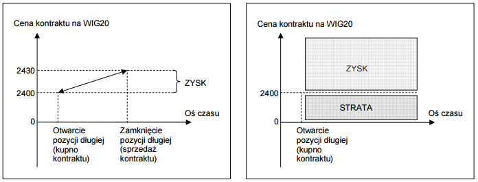

## Definicja Kontraktu

**Kontrakt terminowy** to umowa, w której dwie strony (kupujacy i sprzedajacy kontrakt – odpowiednio wystawca i nabywca kontraktu) zobowiazuja sie wzajemnie odpowiednio do zakupu oraz sprzedazy okreslonych aktywów, w scisle okreslonym momencie czasu w przyszlosci (w „dniu rozliczenia”) po ustalonej w dniu zawarcia umowy cenie („cena wykonania”). Kontrakt jest dla obu stron bezwarunkowym i nieodwolalnym zobowiazaniem do wywiazania sie z jego warunków w terminie wykonania kontraktu.

Kazdy kontrakt terminowy opiera sie na wybranym *instrumencie bazowym*, którym moga byc: akcje, obligacje, indeksy gieldowe, ale równiez: waluty, surowce, towary, stopy procentowe i inne instrumenty.

## Podzial kontraktów

### Podzial kotraktów ze wzgledu na charakter rozliczenia

W zaleznosci od charakteru rozliczenia kontraktu w terminie wygasniecia mozemy podzielic kontrakty terminowe:

  - kontrakty z dostawa 
  - kontrakty rozliczane pienieznie
  
**Kontrakt z dostawa** zawiera w sobie wbudowane zobowiazanie do dostarczenia instrumentu bazowego przez wystawce kontraktu w dniu wygasniecia kontraktu. W wielu przypadkach dostarczenie przedmiotu kontraktu moze jednak wiazac sie ze znacznymi kosztami (np. koszt frachtu kontenera miedzi z Chin do Polski w kontrakcie na dostawe surowca).

**Kontrakty rozliczane** pieniezne nie zawieraja elementu dostawy instrumentu bazowego, a w dniu wygasniecia kontraktu jego nabywca i wystawca jedynie wyrównuja wzajemnie (w formie pienieznej) róznice pomiedzy wartoscia instrumentu bazowego wynikajaca z kontraktu, a rynkowa cena instrumentu bazowego. Kwota wynikajaca z rozliczenia stanowi dla jednej strony zysk, a dla drugiej – strate z operacji na kontraktach terminowych, w zaleznosci od ksztaltowania sie ceny instrumentu bazowego w dniu wygasniecia kontraktu.

Rynek terminowy odróznia sie tym od rynku kasowego (akcyjnego), ze zawarcie umowy (kontraktu) nastepuje w odmiennym momencie czasu niz jej rozliczenie. W chwili zawarcia kontraktu uzgadniana jest jedynie cena wykonania tego kontraktu. Dostarczenie przedmiotu kontraktu oraz rozliczenie transakcji dokonywane jest w dniu wygasniecia kontraktu. Jednak w zadnym razie nie ma obowiazku przetrzymywania kontraktu terminowego do terminu jego wygasniecia. Odpowiednia plynnosc tych instrumentów na rynkach finansowych umozliwia zamykanie kontraktów i otwieranie kolejnych w dowolnym momencie czasu.

### Zasadniczy podzial kotraktów

  - kontrakty terminowe forward 
  - kontrakty terminowe futures

**Kontrakty forward** - w odróznieniu od kontraktów futures nie sa przedmiotem obrotu gieldowego. Stanowia jedynie umowe pomiedzy instytucjami i ich klientami, i maja charakter negocjowany. Kontrakty forward nie podlegaja standaryzacji – warunki umowy kontraktu sa przedmiotem indywidualnych ustalen pomiedzy stronami kontraktu. Najczesciej w momencie zawarcia umowy forward ustala sie wielkosc transakcji i cene, po której zostanie ona zawarta, natomiast dostawa przedmiotu kontraktu nastepuje w terminie wykonania umowy kontraktu.

**Kontrakty futures** - stanowia przedmiot obrotu na rynkach kapitalowych. Ich konstrukcja jest szczególowo regulowana przez rynki (tzw. standardy kontraktu) i nie podlega negocjacjom ani zmianom przez strony umowy kontraktu. W dalszej czesci skoncentrujemy sie wylacznie na kontraktach typu futures. Ksztaltowanie sie ceny rynkowej kontraktu futures w sposób bezposredni zalezy od ceny instrumentu bazowego tego kontraktu (np. cena kontraktu futures na zloto bedzie w scislej korelacji z cena zlota, cena kontraktu na indeks gieldowy bedzie zalezec od zmiennosci notowan indeksu gieldowego etc.).

#Czynniki Ryzyka 

Z inwestowaniem w **kontrakty terminowe** zwiazane sa wszystkie czynniki ryzyka charakterystyczne dla instrumentu bazowego, na który dany kontrakt opiewa. Ponadto czescia nieodzowna inwestowania w kontrakty terminowe typu *futures* (notowane np. na GPW) jest ryzyko bazy, które oznacza, iz cena instrumentu pochodnego moze odbiegac od wartosci teoretycznej instrumentu bazowego. W zwiazku z ograniczonymi wymogami kapitalowymi zwiazanymi z otwarciem pozycji na kontrakcie (wniesienie jedynie depozytu zabezpieczajacego zamiast calej wartosci kontraktu, wykorzystywanie dzwigni finansowej), inwestycje w kontrakty terminowe obarczone sa bardzo wysokim ryzykiem. Klient powinien liczyc sie nie tylko z mozliwoscia utraty calosci zainwestowanego kapitalu, ale równiez z potencjalna strata przekraczajaca wielkosc pierwotnie oplaconego depozytu. Ryzyko plynnosci – plynnosc niektórych kontraktów terminowych jest znaczaco nizsza od plynnosci instrumentów bazowych, na które opiewaja (np. kontrakty na akcje). Zmiennosc notowan kontraktów jest zblizona do zmiennosci instrumentów bazowych, z zastrzezeniem róznic wynikajacych z ryzyka bazy.

###Otwieranie i zamykanie pozycji

Otwarciem pozycji na rynku kontraktów terminowych okresla sie kazdorazowe wejscie inwestora na rynek (czyli zakup kontraktów, badz tez sprzedaz tych instrumentów). Aby w pelni zrozumiec idee otwierania pozycji na kontraktach terminowych, nalezy przelamac poglad, ze nie mozna sprzedac czegos, czego sie nie posiada w danym momencie. W przypadku kontraktów terminowych otwarcie krótkiej pozycji nastepuje przez sprzedaz instrumentu, którego fizycznie nie posiadamy na rachunku. W takiej sytuacji, jezeli zlecenie dojdzie do realizacji bedziemy mieli (-1) pozycje na rachunku (czyli jedna krótka pozycje). KUPNO KONTRAKTU, czyli OTWARCIE DLUGIEJ POZYCJI na kontrakcie terminowym, zgodnie z definicja kontraktu, to zobowiazanie do kupna instrumentu bazowego w dniu wykonania kontraktu po okreslonej cenie. Kupujacy kontrakt spodziewa sie wzrostu ceny instrumentu bazowego w przyszlosci. W kategoriach zabezpieczen – otwierajacy dlugie pozycje zabezpiecza sie przed spadkiem wartosci instrumentu bazowego. Kupuje kontrakty po to, zeby zniwelowac ryzyko spadku wartosci okreslonego instrumentu. W kategoriach spekulacyjnych – otwierajacy dlugie pozycje liczy na wzrost wartosci instrumentu bazowego. SPRZEDAZ (WYSTAWIENIE) KONTRAKTU, czyli OTWARCIE KRÓTKIEJ POZYCJI na kontrakcie terminowym, to zobowiazanie wystawcy kontraktu do sprzedazy instrumentu bazowego w dniu wykonania kontraktu po ustalonej cenie. Wystawca kontraktu spodziewa sie spadku wartosci instrumentu bazowego. 

**W kategoriach zabezpieczen** – otwierajacy krótkie pozycje zabezpiecza sie przed wzrostem wartosci instrumentu bazowego.

**W kategoriach spekulacyjnych** – otwierajacy krótkie pozycje liczy na spadek wartosci instrumentu bazowego.

**W przypadku kontraktów z dostawa** – tabela ponizej przedstawia rozklad rentownosci kontraktu z dostawa w zaleznosci od ksztaltowania sie ceny instrumentu bazowego w dniu wykonania kontraktu.

<table border="l" style="text-align:center; vertical-align:top" >
<tr>
<td></td>
<td>**NABYWCA KONTRAKTU (POSIADACZ DLUGIEJ POZYCJI)**</td>
<td>**WYSTAWCA KONTRAKTU (POSIADACZ KRÓTKIEJ POZYCJI)**</td>
</tr>
<tr>
<td>Cena instrumentu bazowego przewyzsza cene wynikajaca z umowy kontraktu w dniu wygasniecia kontraktu</td>
<td>Nabywca kontraktu relatywnie zyskuje, poniewaz wykonujac kontrakt zakupi przedmiot kontraktu (instrument bazowy) taniej niz gdyby mial zakupic go w tym samym momencie czasu na rynku.</td>
<td>Wystawca kontraktu traci, poniewaz jest zobowiazany do sprzedazy instrumentu bazowego po cenie nizszej niz obowiazujaca w danym momencie na rynku.</td>
</tr>
<tr>
<td>Cena instrumentu bazowego jest nizsza od ceny wynikajaca z umowy kontraktu w dniu wygasniecia kontraktu</td>
<td>Nabywca kontraktu relatywnie traci, poniewaz wywiazujac sie z umowy kontraktu jest zobowiazany do zakupienia instrumentu bazowego po cenie wyzszej niz obowiazujaca w danym momencie na rynku.</td>
<td>Wystawca kontraktu zyskuje, poniewaz sprzedaje instrument bazowy po cenie wyzszej niz cena, która uzyskalby sprzedajac w danym czasie instrument bazowy na rynku. Wystawca moze nabyc w terminie wykonania instrument bazowy na rynku po nizszej cenie i dostarczyc go nabywcy kontraktu po cenie wynikajacej z umowy kontraktu.</td>
</tr>
</table>

**W przypadku kontraktów rozliczanych pienieznie** – tabela ponizej prezentuje rozklad rentownosci w zaleznosci od ksztaltowania sie, w dniu wygasniecia kontraktu, relacji pomiedzy cena instrumentu bazowego a cena wynikajaca z umowy kontraktu. W dniu wygasniecia kontraktu nie dochodzi do fizycznej dostawy przedmiotu kontraktu.

<table border="l" style="text-align:center; vertical-align:top" >
<tr>
<td></td>
<td>**NABYWCA KONTRAKTU (POSIADACZ DLUGIEJ POZYCJI)**</td>
<td>**WYSTAWCA KONTRAKTU (POSIADACZ KRÓTKIEJ POZYCJI)**</td>
</tr>
<tr>
<td>Cena instrumentu bazowego przewyzsza cene wynikajaca z umowy kontraktu w dniu wygasniecia kontraktu</td>
<td>Nabywca kontraktu otrzymuje róznice pomiedzy biezaca cena instrumentu bazowego (w dniu wykonania kontraktu), a cena wynikajaca z umowy kontraktu. Wyplacona kwota jest dla nabywcy kontraktu jego zyskiem</td>
<td>Wystawca kontraktu wyplaca nabywcy róznice pomiedzy biezaca cena instrumentu bazowego, a cena wynikajaca z umowy kontraktu. Wystawca ponosi strate finansowa na transakcji.</td>
</tr>
<tr>
<td>Cena instrumentu bazowego jest nizsza od ceny wynikajaca z umowy kontraktu w dniu wygasniecia kontraktu</td>
<td>Nabywca kontraktu relatywnie traci, poniewaz wywiazujac sie z umowy kontraktu jest zobowiazany do zakupienia instrumentu bazowego po cenie wyzszej niz obowiazujaca w danym momencie na rynku.</td>
<td>Wystawca kontraktu otrzymuje od nabywcy kwote wynikajaca z róznicy pomiedzy cena z umowy kontraktu, a rynkowa cena instrumentu bazowego. Wyplacona kwota jest dla wystawcy kontraktu zyskiem.</td>
</tr>
</table>

###Sposoby wczesniejszego zamkniecia pozycji

Zamkniecie otwartych wczesniej pozycji moze nastapic na dwa sposoby: 

  - w dniu wygasniecia kontraktu przez ich wykonanie po cenie wykonania, 
  - w dowolnym momencie czasu w obrocie gieldowym przez wystawienie zlecenia przeciwstawnego do pozycji posiadanych na rachunku (przez wzajemne zniesienie sie otwartych pozycji). Zatem odpowiednio w przypadku posiadania dlugich pozycji – zamkniecie ich nastapi przez sprzedaz odpowiedniej ilosci kontraktów (czyli przez dokonanie transakcji, w której posiadacz dlugiej pozycji bedzie wystawca kontraktu). Z kolei, w przypadku posiadania krótkich pozycji zamkniecie nastapi przez wystawienie kupna odpowiedniej ilosci kontraktów.
  
  
#Spekulacja nakontraktach terminowych

W tym momencie skoncentrujmy sie na spekulacyjnym charakterze wykorzystania kontraktów terminowych, czyli nastawionym na osiaganie zysku z transakcji tymi instrumentami. Jezeli w ten sposób spojrzymy na kontrakty terminowe, to handel nimi, w najprostszym ujeciu, ogranicza sie do dwóch podstawowych regul:

I.  kup tanio, sprzedaj drozej (dla dlugich pozycji), 
II. sprzedaj drogo i odkup taniej (dla krótkich pozycji).

Przesledzimy przyklad otwarcia dlugiej pozycji na najpopularniejszym kontrakcie terminowym na GPW – kontrakcie na indeks WIG20. (wiecej informacji na temat tego instrumentu w dalszej czesci opracowania). Zakup kontraktu po okreslonej cenie i sprzedaz po cenie wyzszej przeklada sie na zysk dla inwestora. Z kolei, jezeli cena instrumentu zacznie spadac, zamkniecie dlugiej pozycji ponizej ceny zakupu stanowi strate dla inwestora. Na przykladzie, kupujemy kontrakt na indeks WIG20 po 2400 pkt. i sprzedajemy go po 2430 pkt. Dodatnia róznica stanowi zysk z transakcji. 

Wykresy przedstawiaja kolejno: Otwarcie i zamkniecie dlugiej pozycji na kontrakcie terminowym na WIG20 oraz rozklad rentownosci dlugiej pozycji na kontrakcie terminowym na WIG20

Sytuacja zmienia sie, gdy otwieramy krótka pozycje, czyli sprzedajemy kontrakt. Spadek wartosci instrumentu sprawia, ze krótka pozycja przynosi zysk. Z kolei, wzrost wartosci instrumentu powyzej ceny otwarcia krótkiej pozycji przeklada sie na strate z inwestycji w kontrakt terminowy (zgodnie ze schematem ponizej).

Wykresy przedstawiaja kolejno:Otwarcie i zamkniecie krótkiej pozycji na kontrakcie terminowym na WIG20 oraz rozklad rentownosci krótkiej pozycji na kontrakcie terminowym na WIG20

Kazdy kontrakt terminowy notowany na gieldach posiada odpowiednia WARTOSC KONTRAKTU, zgodna ze wzorem:

Wartosc kontraktu = kurs kontraktu x odpowiedni mnoznik

Gdyby nie mnoznik, handel kontraktami nie róznilby sie niczym od handlu zwyklymi akcjami. To wlasnie mnoznik sprawia, ze ryzyko inwestycji w kontrakty terminowe jest zwielokrotnione o wartosc mnoznika. Wartosc kontraktu podaje nam realna wycene inwestycji w kontrakt terminowy.

Na GPW w Warszawie kontrakty terminowe oparte sa o nastepujace mnozniki:

<table border="l" style="text-align:center; vertical-align:top" >
<tr>
<td></td>
<td>**Kurs kontraktu**</td>
<td>**Wartosc kontraktu**</td>
</tr>
<tr>
<td>Otwarcie</td>
<td>2400 pkt</td>
<td>24.000,00 PLN</td>
</tr>
<tr>
<td>Zamkniecie</td>
<td>2430 pkt</td>
<td>24.300,00 PLN</td>
</tr>
<tr>
<td>Zysk brutto</td>
<td>30 pkt</td>
<td>300,00 PLN</td>
</tr>
</table>
Zysk z tytulu zajecia dlugiej pozycji na kontrakcie indeksowym.

<table border="l" style="text-align:center; vertical-align:top" >
<tr>
<td></td>
<td>**Kurs kontraktu**</td>
<td>**Wartosc kontraktu**</td>
</tr>
<tr>
<td>Otwarcie</td>
<td>88,50 PLN</td>
<td>8850,00 PLN</td>
</tr>
<tr>
<td>Zamkniecie</td>
<td>89,20 PLN</td>
<td>8920,00 PLN</td>
</tr>
<tr>
<td>Zysk brutto</td>
<td>0,70 PLN</td>
<td>70,00 PLN</td>
</tr>
</table>

Zysk z tytulu zajecia dlugiej pozycji na kontrakcie aukcyjnym.

<table border="l" style="text-align:center; vertical-align:top" >
<tr>
<td></td>
<td>**Kurs kontraktu**</td>
<td>**Wartosc kontraktu**</td>
</tr>
<tr>
<td>Otwarcie</td>
<td>2500 pkt</td>
<td>25.000,00 PLN</td>
</tr>
<tr>
<td>Zamkniecie</td>
<td>2430 pkt</td>
<td>24.300,00 PLN</td>
</tr>
<tr>
<td>Zysk brutto<</td>
<td>70 pkt</td>
<td>700,00 PLN</td>
</tr>
</table>
Strata z tytulu zajecia dlugiej pozycji na kontrakcie indeksowym.

Jednak sama wartosc kontraktu nie tlumaczy w pelni zjawiska dzwigni finansowej funkcjonujacej w obrocie tymi instrumentami. Aby kupic czy sprzedac kontrakt (otworzyc dluga badz krótka pozycje) nie musimy oplacac calej jego wartosci, a jedynie czesc zwana DEPOZYTEM ZABEZPIECZAJACYM. Depozyt zabezpieczajacy to kwota srodków pienieznych, wzglednie pula papierów wartosciowych blokowana na rachunku otwierajacego pozycje (dluga albo krótka), wymagana dla umozliwienia otwarcia i utrzymania otwartej pozycji na jego rachunku. Z definicji, wysokosc depozytu ma ograniczac do minimum ryzyko niedotrzymania warunków umowy kontraktu. Wysokosc depozytu zabezpieczajacego jest scisle okreslana przez Krajowy Depozyt Papierów Wartosciowych i stanowi okreslony procent pelnej wartosci kontraktu terminowego. Pojecie depozytu wiaze sie nieodlacznie z mechanizmem dzwigni finansowej wystepujacej na rynku terminowym. Mechanizm ten sprawia, ze rynki terminowe ciesza sie ogromna popularnoscia wsród inwestorów na calym swiecie. Odpowiednio, w przypadku kontraktów z dostawa - oplacenie dostawy instrumentu bazowego nastepuje dopiero w momencie wykonania kontraktu w przyszlosci. W momencie zawarcia kontraktu nabywca wnosi jedynie okreslony procent wartosci wynikajacej z dostawy. Z kolei, w przypadku kontraktów rozliczanych pienieznie, nabywca kontraktu wnosi okreslony procent wartosci kontraktu w formie depozytu, a jego zyski lub straty obliczane sa od pelnej wartosci kontraktu (odpowiednio zwiekszaja one lub pomniejszaja saldo depozytu). Depozyt zabezpieczajacy bywa nieraz mylnie nazywany kosztem nabycia kontraktu. Nalezy jednak pamietac, ze kwota depozytu jest blokowana na rachunku otwierajacego pozycje i jezeli inwestor zamknie pozycje z zyskiem, depozyt jest w pelni uwalniany. Z drugiej strony, kazda strata z tytulu otwartych pozycji, bedzie pomniejszala kwote depozytu, co moze prowadzic do wezwania inwestora przez dom maklerski do uzupelnienia depozytu do jego pelnej wysokosci.

Od kwietnia 2009 r. wlasciwy depozyt zabezpieczajacy jest utrzymywany na poziomie wstepnego depozytu. Warto jednak zwrócic uwage na fakt istnienia takiego podzialu i jego historyczne znaczenie. W tym ujeciu, pelna wartosc kwoty depozytu wnoszonej przez inwestora otwierajacego pozycje na instrumencie pochodnym (czyli 100% wartosci depozytu) nosi nazwe depozytu wstepnego. Z kolei, depozyt wlasciwy, to ta czesc depozytu wstepnego, która musi pozostac nienaruszona przez straty na otwartych pozycjach. Kazde naruszenie kwoty depozytu wlasciwego skutkuje wezwaniem do uzupelnienia depozytu przez inwestora.

Historyczny podzial depozytu zabezpieczajacego

<table border="l" style="text-align:center; vertical-align:top" >
<tr>
<td></td>
<td>**Dzienny kurs rozliczeniowy**</td>
<td>**Wartosc kontraktu **</td>
<td>**Depozyt wstepny (w procentach)**</td>
<td>**Depozyt wstepny (w PLN) **</td>
<td>**Depozyt wlasciwy (w procentach) **</td>
<td>**Depozyt wlasciwy (w PLN) **</td>
</tr>
<tr>
<td>WIG20</td>
<td>2548</td>
<td>25480</td>
<td>7,00%</td>
<td>1783,60</td>
<td>5,00%</td>
<td>1274,00</td>
</tr>
</table>
Historyczny przyklad kalkulacji depozytu zabezpieczajacego z podzialem na depozyt
wstepny i wlasciwy.

  
  Bibliografia:
  
  - Money.pl
  - GPW.pl
  - „Inwestycje” K. Jaruga, T. Jaruga

